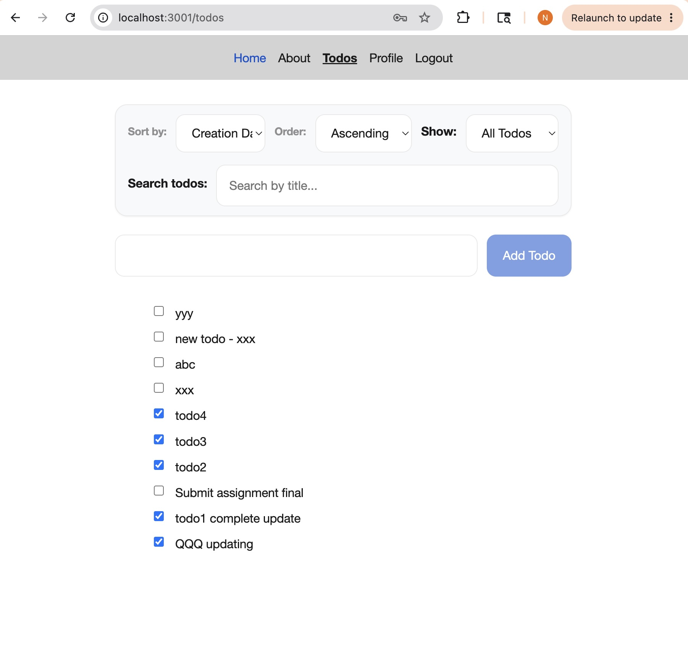
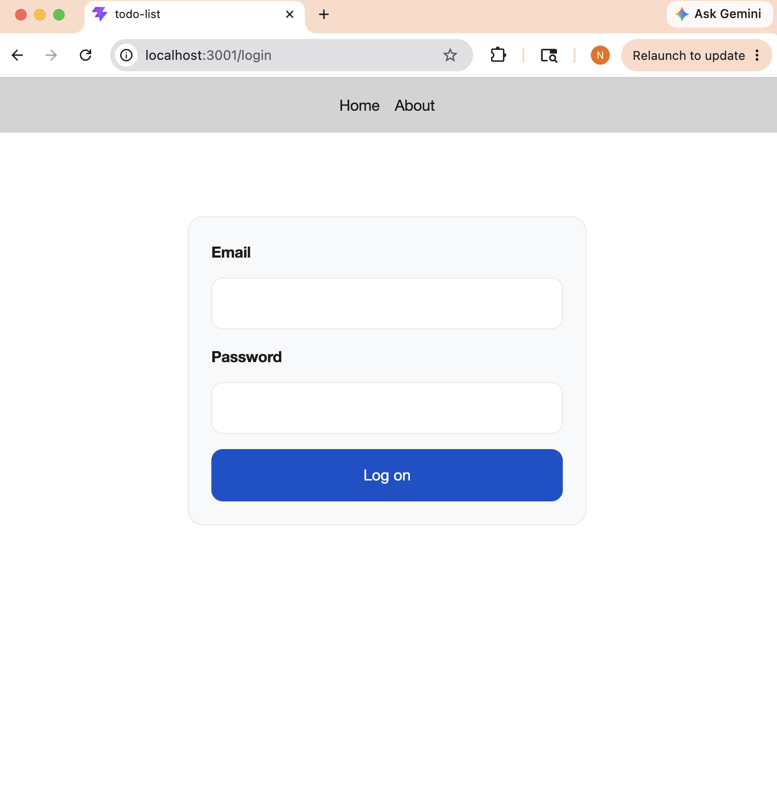
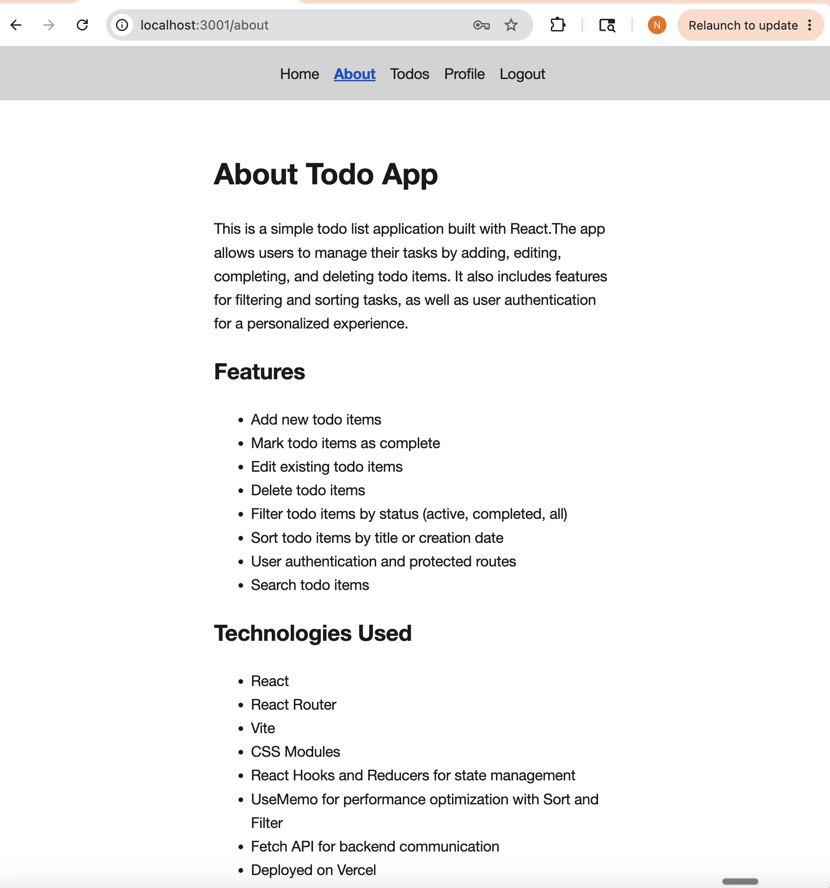
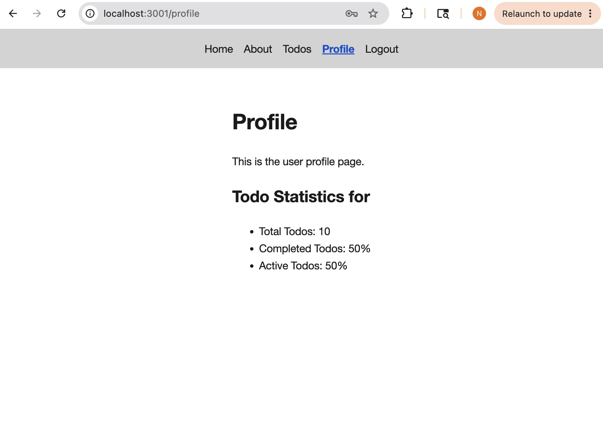

# CTD ToDo List - React ToDo list Application

This is a simple todo list application built with React.The app allows
users to manage their tasks by adding, editing, completing, and deleting
todo items. It also includes features for filtering and sorting tasks,
as well as user authentication for a personalized experience.

## 🚀 Live Demo

[View Live Application](https://your-deployed-app.netlify.app)

## 📸 Screenshots






## 🛠️ Technologies Used

- **Frontend:** React 18, React Router, CSS Modules
- **State Management:** useReducer, useState
- **Build Tool:** Vite
- **Deployment:** Vercel

## ✨ Features

- Add new todo items
- Mark todo items as complete
- Edit existing todo items
- Delete todo items
- Filter todo items by status (active, completed, all)
- Sort todo items by title or creation date
- User authentication and protected routes
- Search todo items

## 🏗️ Installation & Setup

1. Clone the repository:

   ```bash
   git clone https://github.com/nishakrips/todo-list.git
   cd todo-list
   ```

2. Install dependencies:

   ```bash
   npm install
   ```

3. Start the development server:

   ```bash
   npm run dev
   ```

4. Open [http://localhost:3001](http://localhost:3001) in your browser
